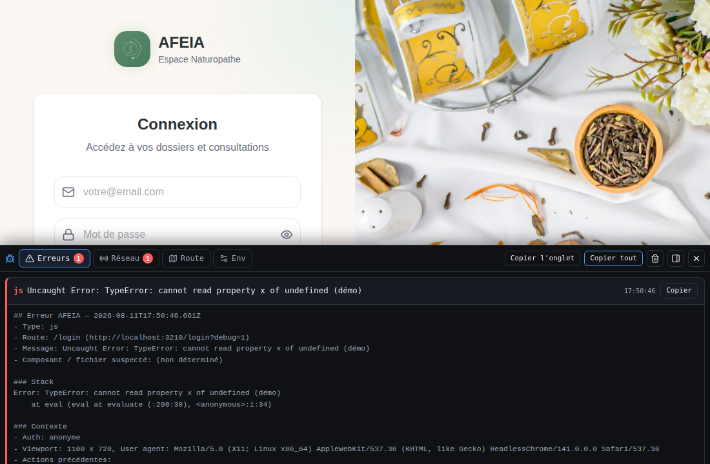

# Mode debug AFEIA — Guide des outils

Ce document décrit le panneau debug extensible et **comment lui ajouter un
outil**. Il est écrit pour qu'une demande du type « ajoute un outil X au panneau
debug » se traduise mécaniquement en quelques étapes, sans avoir à relire tout
le code.



---

## 1. Activation

| Action | Effet |
|---|---|
| `…?debug=1` (ou `?debug=true`) | Active le mode et le persiste en `sessionStorage`. |
| `…?debug=0` (ou `?debug=false`) | Désactive et purge la persistance. |
| Aucun paramètre | Relit l'état persisté (donc reste actif après la 1re activation, le temps de l'onglet). |
| Touche `` ` `` (backtick) | Ouvre / ferme le panneau (ignorée pendant la saisie dans un champ). |
| `Échap` | Ferme le panneau. |

- Le mode n'est **jamais actif par défaut** : il faut au moins une visite avec `?debug=1`.
- **Aucun impact bundle quand il est éteint** : seul un point de montage minuscule (`DebugMount`) est présent partout ; tout le reste (`DebugRuntime`, bus, outils, instrumentation) est chargé via `next/dynamic` **uniquement** quand le mode est actif. Vérifié au build : le runtime n'apparaît pas dans le « First Load JS shared by all ».

---

## 2. Architecture

```
lib/debug/
  types.ts          Types partagés (DebugTool, DebugEvent, DebugEntry…)
  bus.ts            Bus d'événements + fil d'Ariane (publish/subscribe/clear)
  registry.ts       registerDebugTool / getRegisteredTools
  activation.ts     isDebugEnabled() — lecture ?debug= + sessionStorage
  context.ts        getDebugContext() — route, auth (masquée), viewport, UA
  redact.ts         Masquage des secrets (tokens, cookies, e-mails, clés API)
  format.ts         formatDebugEntry() — LE format de rapport copiable
  instrument/
    errors.ts       window.onerror, unhandledrejection, console.error/warn, React
    network.ts      wrappers fetch + XHR
    navigation.ts   history pushState/replaceState, popstate, clics, submits
    index.ts        startInstrumentation() (idempotent) + point d'entrée React

components/debug/
  DebugMount.tsx    Monté dans app/layout.tsx. Vérifie l'activation + import dynamique.
  DebugRuntime.tsx  Démarre l'instrumentation, enregistre les outils, rend le panneau.
  DebugPanel.tsx    CHROME uniquement — lit le registre, rend les onglets. Zéro logique d'outil.
  useDebug.ts       Hooks React (useDebugEvents, useDebugTick).
  ui.tsx            CopyButton, copyText, jetons de couleur.
  tools/
    index.ts        ⚠️ SEUL fichier à modifier pour ajouter un outil.
    ErrorsTool.tsx  Outil « Erreurs »
    NetworkTool.tsx Outil « Réseau »
    RouteTool.tsx   Outil « Route & données »
    EnvTool.tsx     Outil « Environnement »

app/error.tsx, app/global-error.tsx   Error Boundaries qui remontent les erreurs de rendu au bus.
```

**Principe de découplage :**
- Le **bus** est le seul point de rencontre. L'instrumentation y publie ; les
  outils s'y abonnent librement. Il n'existe aucun couplage entre outils.
- Le **panneau** (`DebugPanel`) ne connaît aucun outil : il lit le registre et
  rend les onglets. **Ajouter un outil ne modifie jamais `DebugPanel`.**
- **`components/debug/tools/index.ts` est le seul fichier à éditer** pour
  brancher un nouvel outil.

---

## 3. L'interface `DebugTool`

Définie dans [`lib/debug/types.ts`](../lib/debug/types.ts) :

```ts
export interface DebugTool {
  /** Identifiant unique et stable (sert de clé d'onglet). */
  id: string;

  /** Libellé affiché sur l'onglet. */
  label: string;

  /** Icône de l'onglet (élément React, ex. une icône lucide). */
  icon: ReactNode;

  /**
   * Compteur optionnel affiché en badge sur l'onglet.
   * Renvoyer `null` ou `0` => pas de badge.
   */
  badge?: () => number | null;

  /** Composant rendu quand l'onglet est actif. */
  Panel: ComponentType;

  /**
   * Hook optionnel appelé à CHAQUE événement du bus (effets de bord seulement,
   * pas de rendu). Utile pour agréger des stats, déclencher une alerte, etc.
   */
  onEvent?: (event: DebugEvent) => void;

  /**
   * Rapport Markdown auto-suffisant de cet outil.
   * Le bouton « Copier tout le rapport » concatène le `copyReport()` de tous
   * les outils qui en exposent un.
   */
  copyReport?: () => string;
}
```

### Le bus (`lib/debug/bus.ts`)

```ts
import { getEvents, subscribe, subscribeChange, publish, clearEvents } from '@/lib/debug/bus';

getEvents('network');           // événements d'un type (copie défensive)
subscribeChange(() => { ... });  // notifié à chaque mutation (pour re-render)
subscribe((event) => { ... });   // notifié pour chaque événement individuel
```

Types d'événements : `'error' | 'network' | 'navigation' | 'click' | 'submit' | 'console'`.

Côté React, préférez le hook prêt à l'emploi :

```ts
import { useDebugEvents } from '@/components/debug/useDebug';
const networkEvents = useDebugEvents('network'); // re-render auto à chaque nouvel événement
```

### Le format de rapport (`lib/debug/format.ts`)

`formatDebugEntry(entry: DebugEntry)` produit le bloc Markdown **auto-suffisant**
suivant (recollable dans une nouvelle session sans autre contexte) :

```
## Erreur AFEIA — <horodatage ISO>
- Type: <js | react | network | console | server>
- Route: <chemin> (<URL complète, query comprise>)
- Message: <message>
- Composant / fichier suspecté: <si déterminable>

### Stack
<stack trace nettoyée>

### Requête réseau (si applicable)
- <METHOD> <url> → <status> en <ms>ms
- Réponse (tronquée): <corps>

### Contexte
- Auth: <connecté / anonyme / rôle>
- Viewport: <largeur x hauteur>, User agent: <ua>
- Actions précédentes:
  1. <…>
```

Un **passage de masquage final** est appliqué : tokens, cookies, en-têtes
`Authorization`, mots de passe, e-mails (→ `j***@domaine.fr`) et clés API sont
systématiquement masqués. Réutilisez `formatDebugEntry` dès que votre outil
produit des « entrées » d'erreur ; sinon composez votre propre Markdown.

### Sécurité — masquage (`lib/debug/redact.ts`)

Toute donnée affichée ou copiée doit passer par le masquage :

```ts
import { redactString, redactObject, redactUrl, redactHeaders, redactEmail } from '@/lib/debug/redact';
```

L'instrumentation réseau masque déjà URL, en-têtes et corps. Si votre outil
manipule des données brutes, appliquez `redactObject` / `redactString` avant
affichage.

---

## 4. Exemple complet : ajouter un outil « Storage »

Objectif : un onglet qui liste les clés de `localStorage` / `sessionStorage`
(valeurs masquées), avec un badge = nombre de clés et un `copyReport()`.

### Étape 1 — créer `components/debug/tools/StorageTool.tsx`

```tsx
'use client';

import { useMemo, useReducer } from 'react';
import { Database } from 'lucide-react';
import type { DebugTool } from '@/lib/debug/types';
import { redactString } from '@/lib/debug/redact';
import { DEBUG_COLORS, CopyButton } from '../ui';

function readStorage(kind: 'local' | 'session'): Record<string, string> {
  if (typeof window === 'undefined') return {};
  const store = kind === 'local' ? window.localStorage : window.sessionStorage;
  const out: Record<string, string> = {};
  for (let i = 0; i < store.length; i += 1) {
    const key = store.key(i);
    if (key) out[key] = redactString(store.getItem(key) ?? '');
  }
  return out;
}

function countKeys(): number {
  if (typeof window === 'undefined') return 0;
  return window.localStorage.length + window.sessionStorage.length;
}

function buildReport(): string {
  const local = readStorage('local');
  const session = readStorage('session');
  return [
    '## Storage AFEIA',
    '### localStorage',
    ...Object.entries(local).map(([k, v]) => `- ${k}: ${v}`),
    '### sessionStorage',
    ...Object.entries(session).map(([k, v]) => `- ${k}: ${v}`),
  ].join('\n');
}

function StoragePanel() {
  // Re-render manuel au clic « Rafraîchir » (le storage n'émet pas sur le bus).
  const [, refresh] = useReducer((x: number) => x + 1, 0);
  const local = useMemo(readStorage.bind(null, 'local'), []);
  const session = useMemo(readStorage.bind(null, 'session'), []);

  return (
    <div style={{ padding: 12, color: DEBUG_COLORS.text, fontSize: 12.5 }}>
      <div style={{ display: 'flex', justifyContent: 'flex-end', gap: 6, marginBottom: 8 }}>
        <button type="button" onClick={() => refresh()} style={{ cursor: 'pointer' }}>Rafraîchir</button>
        <CopyButton getText={buildReport} label="Copier l'onglet" />
      </div>
      <pre style={{ whiteSpace: 'pre-wrap', wordBreak: 'break-word' }}>{buildReport()}</pre>
    </div>
  );
}

export const storageTool: DebugTool = {
  id: 'storage',
  label: 'Storage',
  icon: <Database size={14} />,
  badge: () => countKeys() || null,
  Panel: StoragePanel,
  copyReport: buildReport,
};
```

### Étape 2 — le brancher dans `components/debug/tools/index.ts`

```ts
import { registerDebugTool } from '@/lib/debug/registry';
import { errorsTool } from './ErrorsTool';
import { networkTool } from './NetworkTool';
import { routeTool } from './RouteTool';
import { envTool } from './EnvTool';
import { storageTool } from './StorageTool'; // 👈 nouvel import

registerDebugTool(errorsTool);
registerDebugTool(networkTool);
registerDebugTool(routeTool);
registerDebugTool(envTool);
registerDebugTool(storageTool); // 👈 nouvel enregistrement
```

### Étape 3 — c'est tout

Rechargez avec `?debug=1` : un onglet **Storage** apparaît, avec son badge, son
panneau et sa contribution au bouton « Copier tout ». **Aucun autre fichier n'a
été touché** (ni `DebugPanel`, ni `bus`, ni `registry`).

### Variante : consommer le bus

Si votre outil doit réagir aux événements (ex. compter les erreurs 500) :

```tsx
import { useDebugEvents } from '@/components/debug/useDebug';

function MonPanel() {
  const network = useDebugEvents('network');
  const errors500 = network.filter((e) => (e.payload as any).status === 500);
  return <div>{errors500.length} erreurs serveur</div>;
}

export const monOutil: DebugTool = {
  id: 'srv-errors',
  label: 'Serveur',
  icon: <ServerCrash size={14} />,
  badge: () => /* lire getEvents('network') et filtrer */ null,
  Panel: MonPanel,
  // onEvent est aussi disponible pour des effets de bord sans rendu :
  onEvent: (event) => { if (event.type === 'network') { /* … */ } },
};
```

---

## 5. Rappels

- **Un outil est autonome.** Il ne référence jamais un autre outil.
- **Toujours masquer** avant d'afficher/copier des données potentiellement sensibles.
- **`id` stable et unique** (sert de clé de persistance de l'onglet actif).
- **Styles inline / thème sombre** : le panneau ne dépend pas de Tailwind pour
  rester lisible par-dessus n'importe quelle page ; suivez `DEBUG_COLORS` de
  `components/debug/ui.tsx` pour rester cohérent.
- **Exposer les données d'une page à l'outil « Route »** : une page peut faire
  `window.__afeiaDebugPageData = { … }` (masqué automatiquement) pour les voir
  dans l'onglet Route.
